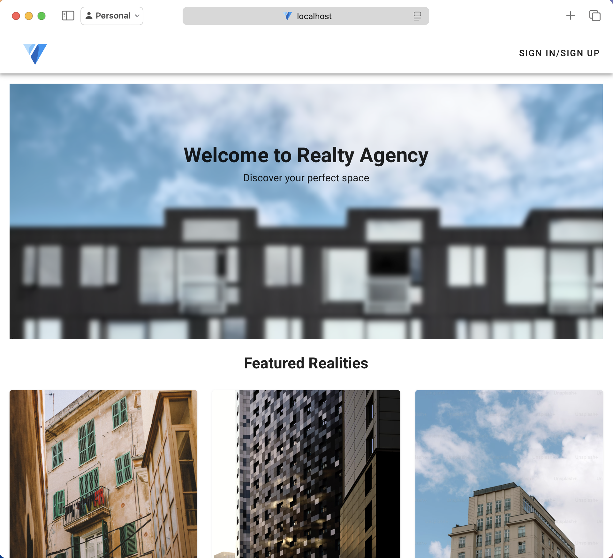
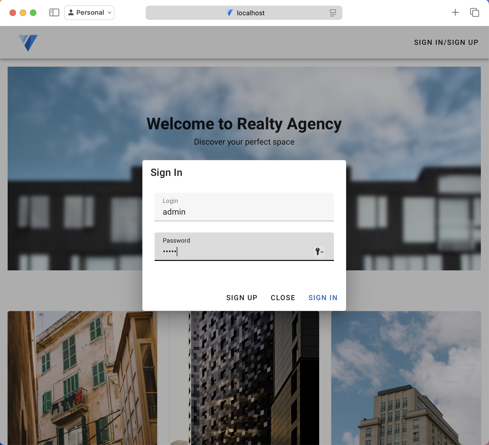
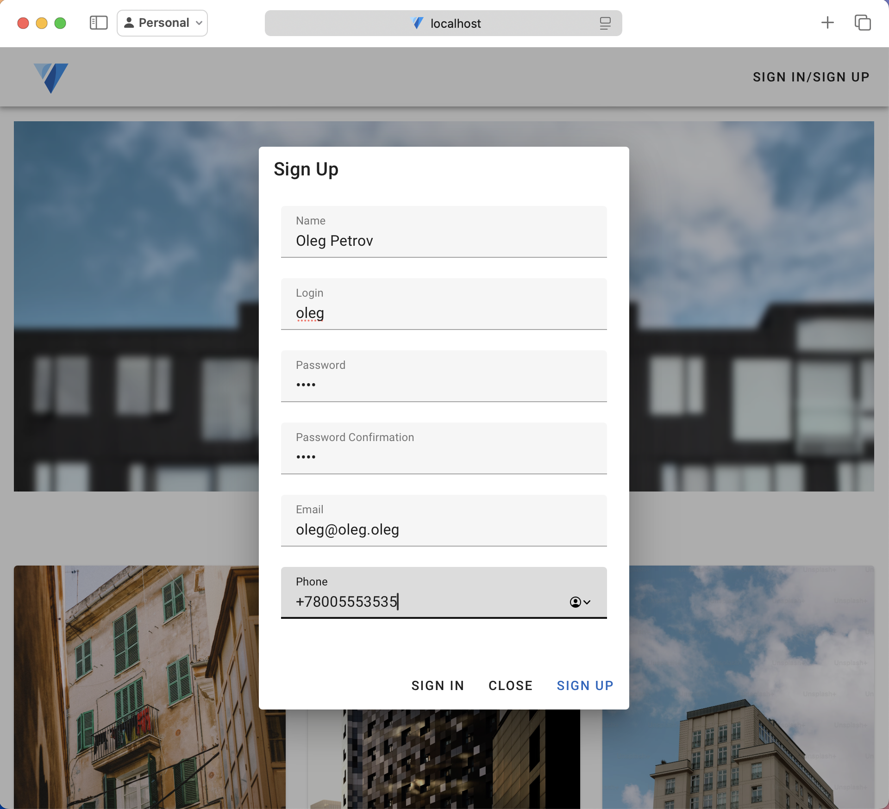
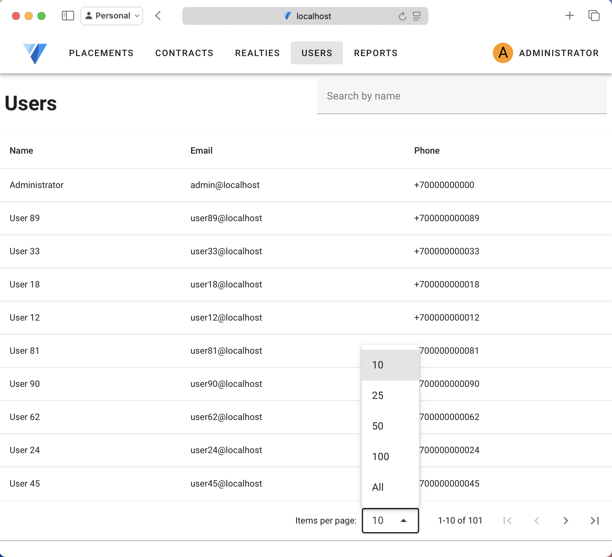
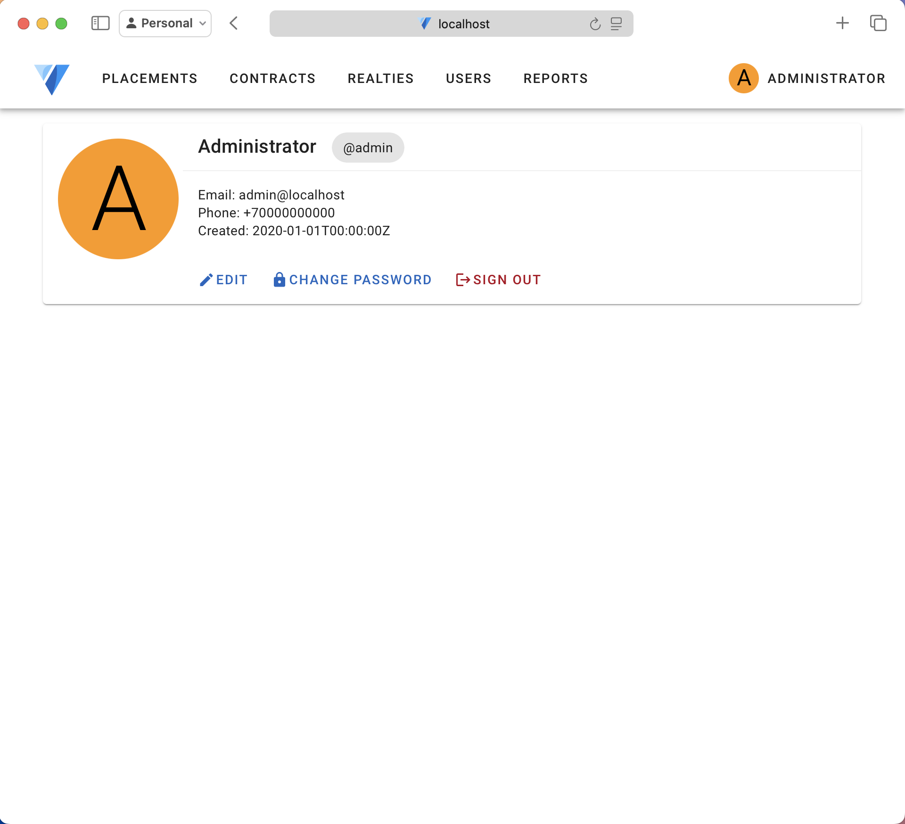
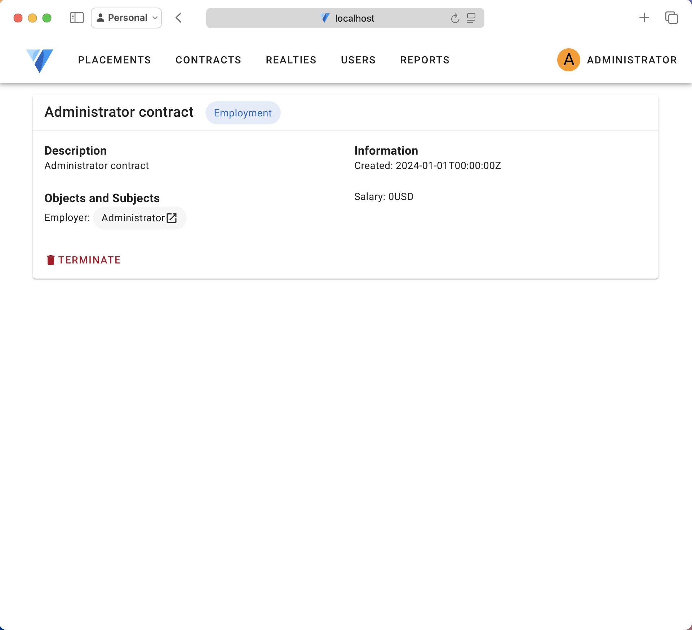

# frontend

[](https://github.com/BashSdo/real-estate-agency-frontend)

Frontend application for the real estate agency project.

# Building

To build a release Docker image run the following command:

```sh
just image_build
```

# Screenshots








Before sending a pull request, please make sure you have read the [contributing guidelines](CONTRIBUTING.md).
